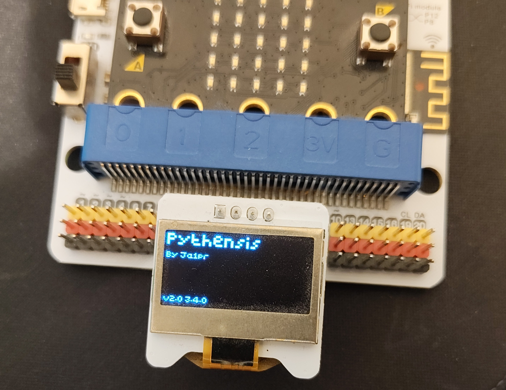
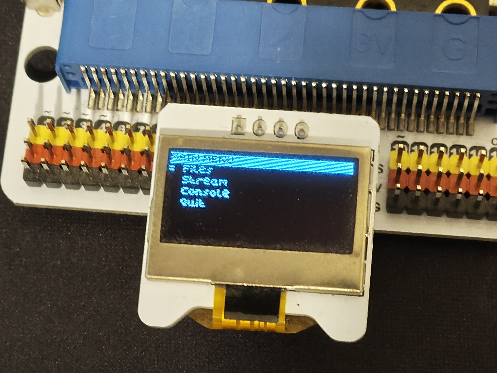
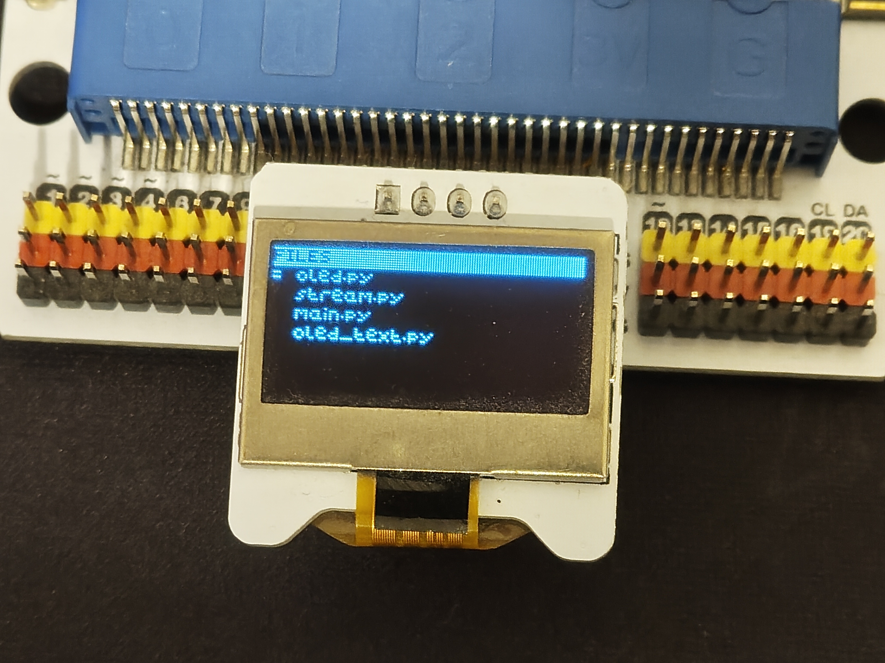

# 🐍 Pythensis

> **Lightweight, memory-efficient OS written in MicroPython for BBC micro:bit v1. So memory-optimized that even the 'OS' in the name didn't fit into RAM.**

Pythensis is a custom OS written entirely in MicroPython, developed to test the boundaries of the BBC micro:bit v1 (Nordic nRF51822 with only 16 KB RAM).

**Warning:** If you try editing the code, there is almost a certain chance that it will crash on a `MemoryError` *(trust me, try deleting or adding just one letter in the OS menu title and run it)*.

The system is named after ***Python perthensis*** (Pygmy Python) – the smallest python species in the world.

  
  
  

## Credits: 
huge thanks to all who made this project possible
* **[fizban99](https://github.com/fizban99)** – MicroPython I2C SSD1306 driver architecture for micro:bit.
* **Dmitrii (dmitryelj@gmail.com)** – `adafruit_Python_SSD1306` library concepts.
* **lopyi2c.py** – Early I2C MicroPython driver implementations.
* **Steve Stagg** – OLED effect concepts.
---

##  Features
1. **File Explorer:** See which files are stored on your micro:bit filesystem.
2.  **UART Video Streamer:** Stream video directly from your PC to the micro:bit OLED screen in real-time! *(Requires a helper Python script on the PC to work)*.
3.  **Console:** Send Python commands remotely from your PC to the micro:bit. *(Requires a PC script, or use the Serial WebUSB window at https://python.microbit.org/)*.
4.  **Quit:** This may not seem like a feature, but it shuts down your micro:bit the correct way *(I know you never did it)*.

##  Architecture
* **main.py** – The "kernel", bootloader, and main menu loop.
* **oled.py** – Basic graphics drivers for the SSD1306 display.
* **oled_text.py** – Extended graphics drivers for text rendering.
* **stream.py** – The first "user" app in the OS, handles high-speed video streaming.

## Requirements
1. **Board:** BBC micro:bit v1 *(or v2)*. With slight modifications (mainly to graphics/pin drivers), it should also run on **ESP32** or **Raspberry Pi Pico/Zero** *(untested)*.
2. **Display:** 0.96" SSD1306 OLED Display (128x64 resolution, I2C address `0x3C`).

##  How to Run
1. Flash standard **MicroPython** onto your micro:bit (v1 or v2).
2. Upload `main.py`, `oled.py`, `oled_text.py`, and `stream.py` to the micro:bit using **Thonny**, **Mu Editor**, or [python.microbit.org](https://python.microbit.org/).
3. Reset the board — **Pythensis** will boot directly into the `MAIN MENU`.
4. Use buttons **A** and **B** to navigate the menu, press **A+B** together to select an option (or exit the File Explorer).
5. Select **Stream Mode** in the Pythensis menu on your micro:bit.
6. Launch **`pythensis_connect.exe`** on your PC, select the auto-detected COM port, and start streaming video, sharing your screen, or using the shell console!

##  Pythensis CONNECT (PC Companion App)

**Pythensis CONNECT** links your PC to your micro:bit over USB, unlocking real-time video streaming, screen sharing, and direct UART console control.

###  Features
*  **Video Streamer:** Plays any video (`.mp4`, `.avi`...) on the OLED display using high-quality dithering.
*  **Screen Share:** Streams your PC screen or retro games (like DOOM!) in real time with Auto-Canny and custom resolutions.
*  **Shell Console:** Send live serial commands directly to your micro:bit.
* **Docs & Cheatsheet:** Built-in MicroPython cheat sheet and one-click access to [python.microbit.org](https://python.microbit.org/).

##  License

Distributed under the **MIT License**.
